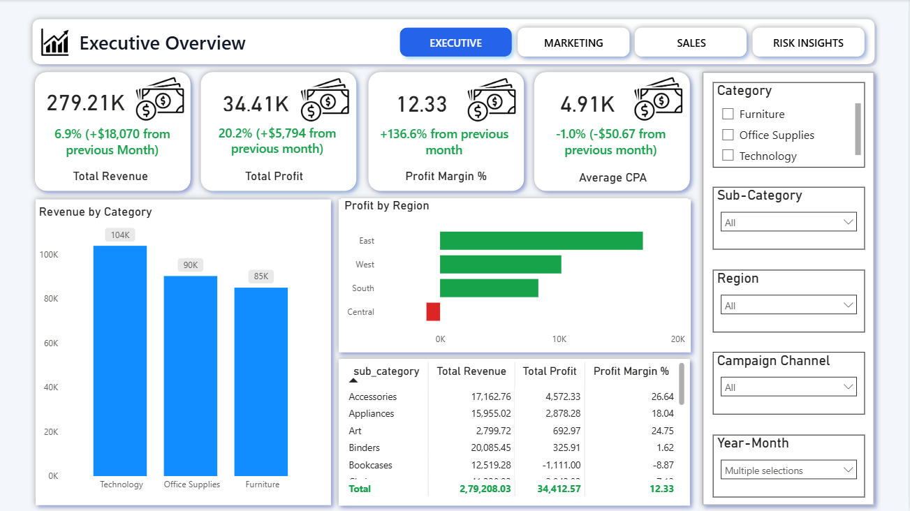
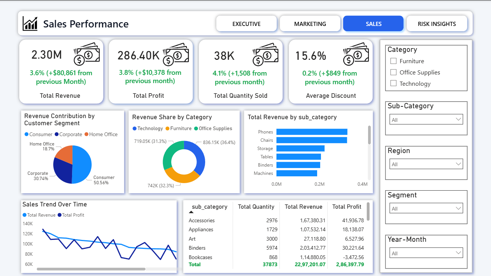
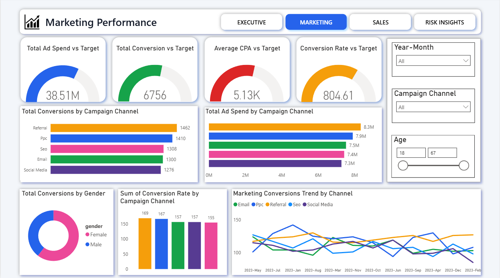

# 📊 Sales & Marketing Business Intelligence Dashboard

## Project Overview
This project is an end-to-end Sales and Marketing BI solution designed to help business stakeholders
monitor performance, identify key drivers, and make data-driven decisions.

The dashboard provides insights into revenue growth, profit stability, discount dependency,
conversion efficiency, and marketing effectiveness.

- Track key performance indicators (KPIs)
- Understand sales and marketing performance
- Identify growth trends and risks
-  Optimize revenue and campaign efficiency

---

##  Data Description
- Sales data: Revenue, Profit, Quantity, Discount, Category, Region
- Marketing data: Campaign channel, Ad spend, Conversions, CPA, Conversion rate

> Note: Sample/cleaned data is used for demonstration purposes.

---

## Dashboard Pages
### 1️⃣ Executive Overview
- Key KPIs with Month-over-Month change
- Revenue, Profit, Margin, CPA trends

### 2️⃣ Sales Performance
- Regional and category-level analysis
- Quantity and discount insights
- Profit vs discount impact

### 3️⃣ Marketing Performance
- Campaign effectiveness
- Conversion efficiency
- Cost vs performance metrics

### 4️⃣ Performance Drivers & Risk Insights
- Revenue growth intensity (Gauge)
- Profit volatility (Risk indicator)
- Discount dependency analysis
- Conversion efficiency trends

---

##  Key Business Insights
- Identified revenue growth trends and risk periods
- Highlighted impact of discounting on profit margins
- Evaluated marketing efficiency beyond CPA
- Provided executive-friendly, interactive insights

---

##  Dashboard Preview

---

## How to Use
1. Clone the repository
2. Open the `.pbix` file using Power BI Desktop
3. (Optional) Load data into MySQL using provided SQL scripts
4. Refresh the Power BI report

---

## 👤 Author
**NANDHA GOPAL R**  
Aspiring Data Analyst | Power BI | SQL | Python

